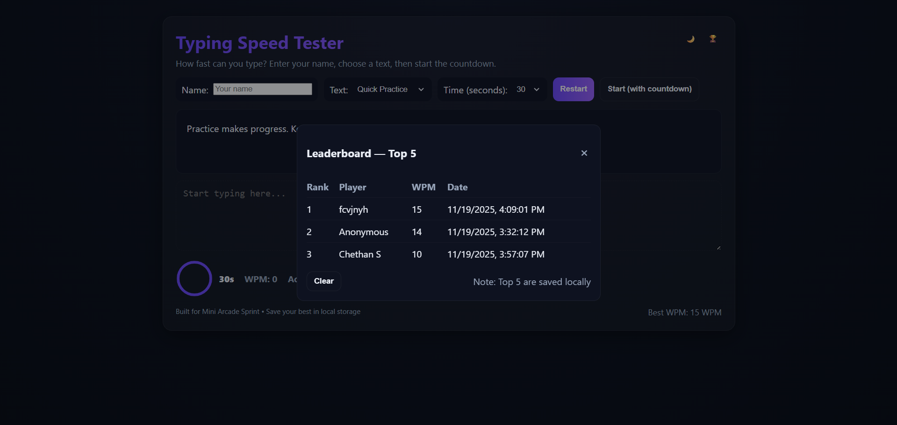

# 🎮 Typing Speed Tester

A clean, fast, and interactive typing speed test game built for the **Mini Arcade Sprint**.  
Made using **HTML, CSS, and JavaScript** — no frameworks.

---

## 📌 Features

### 🎯 Core Features
- Real-time typing validation  
- Live WPM (Words Per Minute) calculation  
- Accuracy tracking  
- Error detection & highlighting  
- Countdown mode (5 → 1 → GO)  
- Circular animated timer  

### ✨ Visual & Audio Enhancements
- Glow effect during typing  
- Particle burst animation on correct keypress  
- Wrong-key underline effect  
- Light/Dark theme toggle  
- Mechanical keyboard click (correct)  
- Error buzz (wrong)  
- Countdown beep + final fanfare  

### 🏆 Leaderboard
- Stores **Top 5 WPM scores**  
- Saves **Name, WPM, Timestamp**  
- Saves locally using `localStorage`  

---

## 📁 Folder Structure

typing-speed-tester/
│
├── index.html # Main UI
├── style.css # Styling, animations, themes
├── script.js # Game logic + leaderboard + countdown
├── sounds/ # Sound effects (correct, wrong, countdown)
└── README.md # Project documentation

---

## 🚀 How to Run Locally

1. Download or clone the repository  
2. Open the folder in VS Code  
3. Open `index.html` in your browser  
   - (Recommended) Use **Live Server** for instant reloads  
4. Enter your name → Select text → Select time → Start typing!

---

## 🌐 Deployment

### GitHub Pages
1. Go to your repository  
2. **Settings → Pages**  
3. Source:  
   - Branch: `main`  
   - Folder: `/ (root)`  
4. Save and wait for deployment  
5. Your game will be live at:  

https://<your-username>.github.io/mini-arcade-games/

### Netlify / Vercel (Optional)
- Drag and drop the folder  
- OR connect your GitHub repo  
- Auto-deploys instantly  

---

## 🖼️ Screenshots (Optional)

-Game Interface

-🏆LeaderBoard

---

## 📝 Notes
- 100% Vanilla HTML + CSS + JS  
- All assets kept lightweight  
- Works fully offline after loading once  
- Optimized for desktop use  

---

## 🏁 Built For
**Mini Arcade Sprint — Create Your Own Mini Game Challenge**

